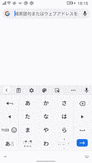

# KodomoKeyboard(こどもキーボード)

KodomoKeyboard is a simple Android custom keyboard for Pre School Children. 

It supports to input hiragana(ひらがな) and katakana(かたかな).

It is optimized for small screen device like Unihertz Jelly 2 

 - Jetpack Compose
 - Simple Elm Architecture with Kotlin Coroutine Flow

## ScreenShot

## References 

[elmo](https://github.com/bobymicroby/elmo)
